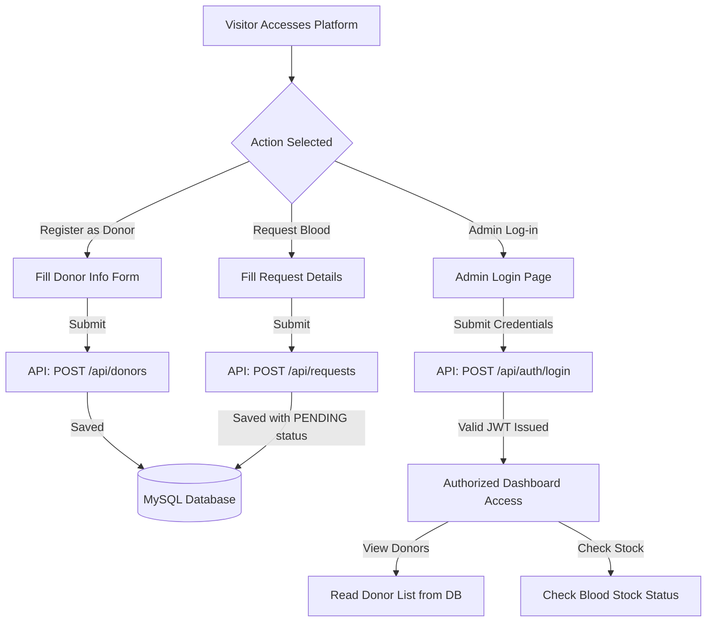

# 🩸 Blood Bank Management System

<div align="center">

[](https://spring.io/projects/spring-boot)
[](https://react.dev/)
[](https://tailwindcss.com/)
[](https://www.mysql.com/)
[](https://www.docker.com/)

### A Smart, Secure Blood Donation & Management Platform

Connecting **donors**, **hospitals**, and **blood banks** to facilitate life-saving coordination during medical emergencies.

</div>

---

## 📌 Table of Contents

- [Introduction](#-introduction)
- [Key Features](#-key-features)
- [Tech Stack](#️-tech-stack)
- [Project Structure](#-project-structure)
- [Setup & Installation](#-setup--installation)
  - [Prerequisites](#prerequisites)
  - [Option A: Running with Docker Compose (Recommended)](#option-a-running-with-docker-compose-recommended)
  - [Option B: Running Locally (Manual)](#option-b-running-locally-manual)
- [Database Seeding & Authentication](#-database-seeding--authentication)
- [API Endpoints](#-api-endpoints)
- [System Workflow](#-system-workflow)
- [Developer & Contact](#-developer--contact)

---

## 📌 Introduction

The **Blood Bank Management System** is a modern full-stack healthcare application designed to streamline blood donation registration and emergency blood requests. By replacing manual workflows with digital coordination, the platform aims to reduce emergency response times, optimize stock visibility, and connect donors directly with recipient institutions.

---

## ✨ Key Features

### 👤 Donor Module
- **Public Registration:** Donors can quickly register through a public form specifying their blood type, age, contact information, and address.
- **Privacy Controls:** Donor information is securely stored and only accessible to authorized administrators.

### 🏥 Blood Requests
- **Public Blood Requests:** Hospitals or individuals in urgent need can submit a blood request specifying required units, urgency level, and contact person.
- **Emergency Classification:** Requests are tagged with urgency levels (e.g., Critical, Urgent, Normal) for prioritization.

### 🔐 Administrative & Inventory Controls (Role-Based)
- **Admin Dashboard:** Access-restricted dashboard for managing system resources.
- **Donor Management:** Authorized admins can view the complete list of registered donors and remove entries.
- **Blood Stock Tracking:** Interactive inventory view tracking available units by blood type with visual indicators for low and critical stock levels.

---

## 🛠️ Tech Stack

### Frontend
- **React 18.3 & Vite** (Fast build toolchain and modern UI component rendering)
- **Tailwind CSS 3.4** (Premium, clean utility-first responsive styling)
- **Lucide React** (Vector iconography)
- **Axios** (Promise-based HTTP client for API interactions)
- **React Router DOM 7** (Declarative routing and navigation guards)

### Backend
- **Java 21 & Spring Boot 3.5.5** (Enterprise-grade runtime and REST APIs)
- **Spring Security & JWT** (Stateless authentication with role-based authorization)
- **Spring Data JPA & Hibernate** (ORM and relational mapping)
- **Apache Maven** (Dependency management and build lifecycle)

### Database & Devops
- **MySQL 8.0** (Relational storage for donors, users, and blood requests)
- **Docker & Docker Compose** (Containerized orchestration for DB, backend, and frontend)
- **Nginx** (Serving the static React application in production container)

---

## 📂 Project Structure

```bash
bloodbank-app/
├── bloodbank-backend/     # Spring Boot Java Backend
│   ├── src/               # Application source code
│   ├── Dockerfile         # Backend lightweight runner Dockerfile
│   ├── mvnw / mvnw.cmd    # Maven wrappers
│   └── pom.xml            # Dependency configurations
├── bloodbank-frontend/    # React + Vite Frontend
│   ├── src/               # UI components, contexts, pages, and services
│   │   ├── components/    # Reusable UI elements (Button, Card, Table, etc.)
│   │   ├── context/       # Auth state management provider
│   │   ├── pages/         # View pages (Home, Registration, Inventory, etc.)
│   │   └── services/      # Axios API wrappers
│   ├── Dockerfile         # Multi-stage Docker build (Node build -> Nginx host)
│   ├── nginx.conf         # Nginx reverse proxy configuration
│   └── package.json       # Node package manager config
├── docker-compose.yml     # Multi-container orchestration config
└── README.md              # Project documentation
```

---

## ⚙️ Setup & Installation

### Prerequisites
Make sure you have the following installed:
- [Java Development Kit (JDK) 21](https://oracle.com/java/technologies/downloads/)
- [Node.js 18+](https://nodejs.org/)
- [Docker & Docker Compose](https://www.docker.com/) (Optional, but highly recommended)
- [Maven](https://maven.apache.org/) (Or use the included `./mvnw` wrapper)

---

### Option A: Running with Docker Compose (Recommended)

The project includes a ready-to-run `docker-compose.yml` file configuring the MySQL database, Spring Boot backend, and React/Nginx frontend.

> [!IMPORTANT]
> The backend Dockerfile copies `target/*.jar`. You must build the backend JAR file locally on your host machine **before** running Docker Compose.

#### 1. Compile and Package the Backend
Open a terminal in the `bloodbank-backend` directory and run:
```bash
# On Linux/macOS
./mvnw clean package -DskipTests

# On Windows (Command Prompt or PowerShell)
.\mvnw.cmd clean package -DskipTests
```

#### 2. Launch the Orchestrated Containers
Navigate back to the root directory containing `docker-compose.yml` and run:
```bash
docker compose up --build
```

#### 3. Access the Services
Once running, the applications are available at:
- **Frontend App:** [http://localhost:5173](http://localhost:5173)
- **Backend API:** [http://localhost:9092](http://localhost:9092)
- **Database Port:** `3306`

---

### Option B: Running Locally (Manual)

If you prefer to run the applications directly on your local system:

#### 1. Setup the Database
- Start your local MySQL service.
- Create a database named `bloodbank`:
  ```sql
  CREATE DATABASE bloodbank;
  ```

#### 2. Configure Environment Properties
Open `bloodbank-backend/src/main/resources/application.properties` and verify your datasource credentials:
```properties
spring.datasource.url=jdbc:mysql://localhost:3306/bloodbank
spring.datasource.username=your_mysql_user
spring.datasource.password=your_mysql_password
```

#### 3. Start the Backend
Open a terminal in `bloodbank-backend` and execute:
```bash
# On Linux/macOS
./mvnw spring-boot:run

# On Windows
.\mvnw.cmd spring-boot:run
```
The server will start on port **`9092`**.

#### 4. Start the Frontend
Open a new terminal in `bloodbank-frontend` and run:
```bash
npm install
npm run dev
```
The Vite development server will spin up on **`http://localhost:5173`**.

---

## 🔐 Database Seeding & Authentication

When the Spring Boot backend starts, it checks for existing users. If the database is empty, it automatically seeds a default administrator account:

- **Admin Email:** `admin@bloodbank.local`
- **Admin Password:** `Admin@123`
- **Default Role:** `ROLE_ADMIN`

Use these credentials on the **Admin Login** page (`/admin-login`) to access the protected Donor list and Blood Inventory dashboards.

---

## 🔌 API Endpoints

All backend endpoints are prefixed with `/api`.

### 👥 Public Endpoints

| Method | Endpoint | Payload / Description |
| :--- | :--- | :--- |
| `POST` | `/api/auth/login` | Authenticate admin user. Expects JSON `{ "email", "password" }`. Returns JWT. |
| `POST` | `/api/donors` | Submit a public donor registration. Expects donor information. |
| `POST` | `/api/requests` | Submit a public emergency blood request. |

### 🔒 Protected Endpoints (Admin Only)
*Must include header `Authorization: Bearer <JWT_TOKEN>`*

| Method | Endpoint | Description |
| :--- | :--- | :--- |
| `GET` | `/api/auth/me` | Fetch authenticated account profile info. |
| `GET` | `/api/donors` | Retrieve list of all registered blood donors. |
| `DELETE` | `/api/donors/{id}` | Permanently remove a donor record. |

---

## 🖥️ System Workflow

The following flowchart outlines the lifecycle of blood donor registration and emergency requests within the application:



---

## 📬 Contact

**Developer:** Mahesh Sai  
- **GitHub:** [@2300030811](https://github.com/2300030811)  
- **Email:** [2300030811cser@gmail.com](mailto:2300030811cser@gmail.com)  

---

<div align="center">

### ❤️ Donate Blood, Save Lives

_"A single drop of blood can make a wave of difference."_

</div>
